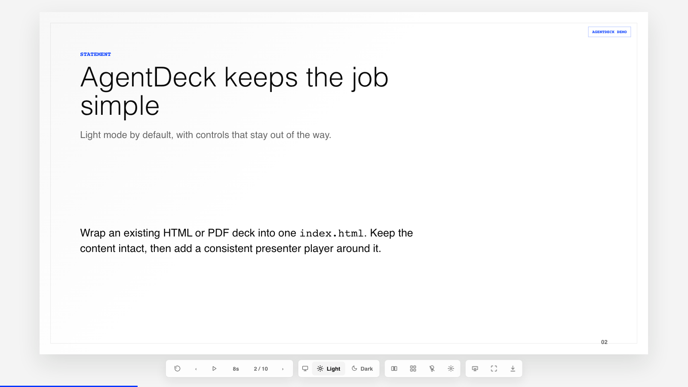
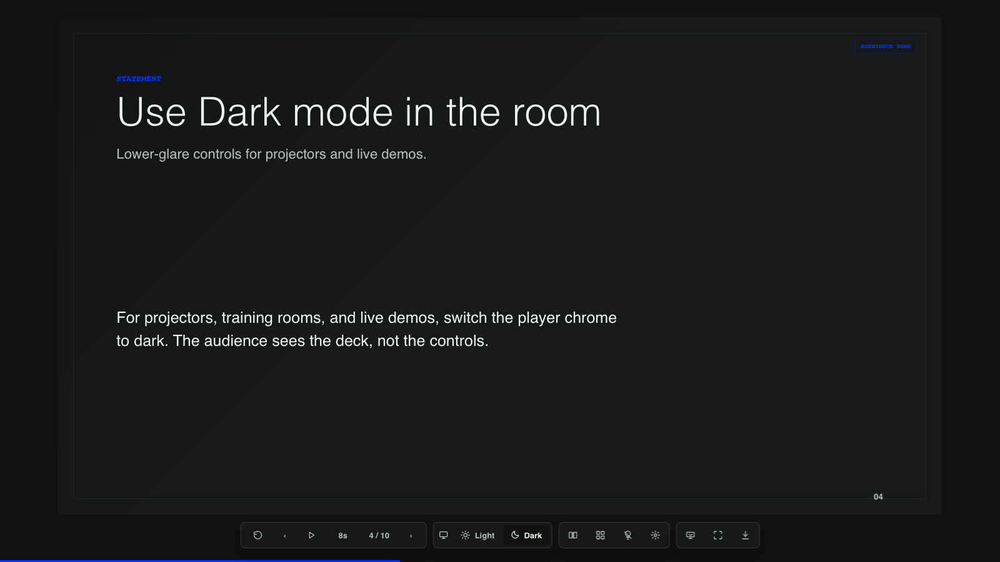
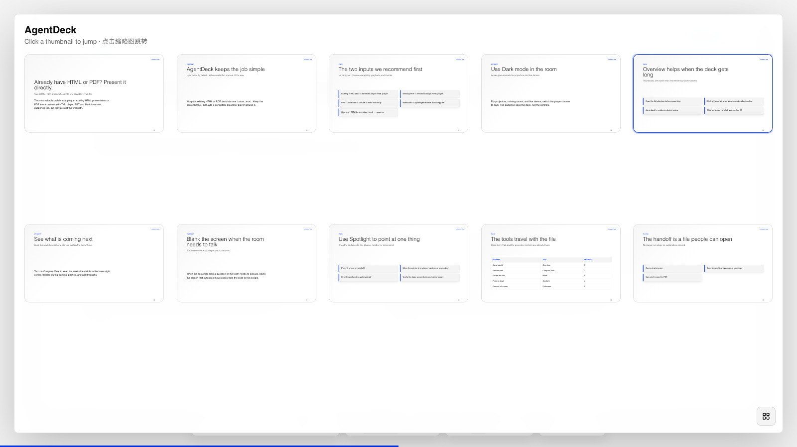
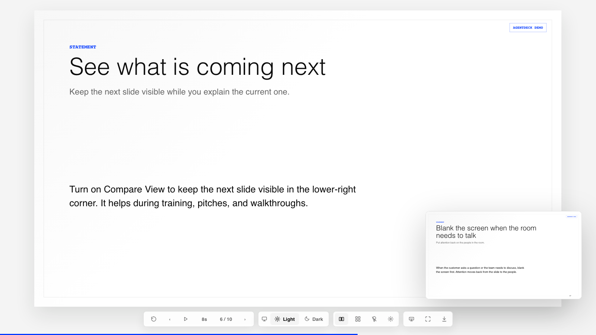
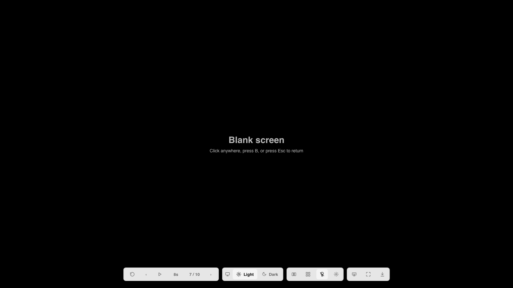
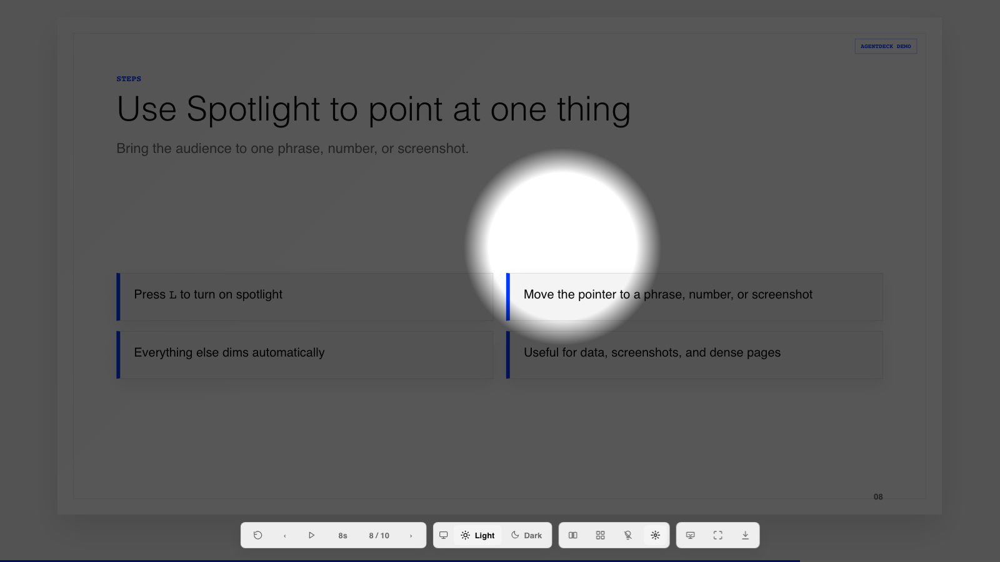

# AgentDeck

AgentDeck is a **single-file HTML playback and delivery layer** for presentation files.

Positioning:

**Wrap HTML, PDF, PPT, or Markdown presentations into one playable, shareable, exportable single-file HTML.**

## Screenshots

| Light mode | Dark mode |
|---|---|
|  |  |

| Overview | Compare View |
|---|---|
|  |  |

| Blank screen | Spotlight |
|---|---|
|  |  |

## Product Boundary

AgentDeck does not make slides for users, choose third-party PPT skills, imitate template systems, or re-layout Office/PDF content.

It does one lower-level job:

- accept existing `.html`, `.pdf`, `.ppt`, `.pptx`, `.key`, `.doc`, `.docx`, `.xls`, `.xlsx`, or `.md` files
- preserve the source visuals as much as possible
- generate one self-contained `index.html`
- add the AgentDeck presenter controls

The product focus is compatibility, playback, sharing, and export.

## Current Support Maturity

AgentDeck is currently most stable and most recommended for:

- existing HTML presentation -> enhanced single-file HTML player
- existing PDF -> enhanced single-file HTML player

These are the primary routes today. Their goal is high-fidelity playback, sharing, thumbnail overview, blank screen, spotlight, autoplay, print/PDF, and other presentation controls.

`.ppt`, `.pptx`, `.key`, `.doc`, `.docx`, `.xls`, `.xlsx`, and `.md` are also supported, but they should be treated as experimental compatibility routes:

- Office files depend on local LibreOffice, Keynote, Quick Look, or Windows Office COM to become PDF first.
- Markdown is a lightweight fallback authoring path, not AgentDeck's primary product promise.
- These routes prioritize playable delivery, not editable Office compatibility or perfect fidelity for every complex layout.

## Relationship To PPT Design / Generation Skills

AgentDeck does not provide content restructuring, visual design, PPT beautification, or template generation.

If you need to turn ideas, documents, or rough material into a polished deck, use the PPT generation, PPT beautification, or design skill/tool you trust first. Then use AgentDeck to wrap the final HTML, PDF, or Office output into one enhanced single-file HTML player.

AgentDeck is the presentation delivery layer, not the content creation layer.

## Compatibility Routes

### Office Files

```bash
agentdeck wrap deck.pptx --out dist
agentdeck wrap deck.ppt --out dist
agentdeck wrap deck.key --out dist
agentdeck wrap deck.docx --out dist
agentdeck wrap deck.xlsx --out dist
```

Flow:

1. Convert Office files to PDF with local LibreOffice / `soffice`, macOS Keynote/Quick Look, or Windows Office COM.
2. Render each PDF page to a high-resolution PNG.
3. Inline every page into one HTML file.
4. Add the AgentDeck player.

This is playback-level compatibility, not Office-editing compatibility. It prioritizes visual fidelity.

One boundary is important here: AgentDeck does not replace the Office rendering engine. For `.ppt` and `.pptx`, the core route is still `LibreOffice -> PDF -> page images -> single HTML`. What AgentDeck improves is compatibility routing, diagnostics, and the playback layer around the result.

There is now one formal macOS fallback for presentation files: if LibreOffice is unavailable but `Keynote.app` is installed, AgentDeck can automatically try `Keynote -> PDF -> page images -> single HTML` for `.ppt` and `.pptx`. This path has been verified locally.

For `.doc`, `.docx`, `.xls`, and `.xlsx`, there is now a second native macOS fallback: `Quick Look Preview.html -> Chromium PDF print -> page images -> single HTML` when LibreOffice is unavailable. This path has been verified locally with a real `.docx` file.

On Windows, the CLI also includes Microsoft Office COM export fallbacks:

- `PowerPoint -> PDF`
- `Word -> PDF`
- `Excel -> PDF`

That code path is now wired in, but it has not been runtime-verified on this macOS machine.

### PDF

```bash
agentdeck wrap deck.pdf --out dist
agentdeck wrap deck.pdf --out dist --dpi 220
agentdeck wrap deck.pdf --out dist --fit contain
agentdeck wrap deck.pdf --out dist --image-format webp --quality 82 --size-budget 50mb
agentdeck wrap deck.pdf --out dist --max-pages 100 --max-output-mb 80
agentdeck wrap deck.pdf --out dist --pack folder
```

Each PDF page is rendered to an image and packed into a single HTML file.

PDF rendering now selects the best available backend automatically:

- `pdftoppm`
- `pdftocairo`
- `pypdfium2` when available in the local Python environment
- `pdf2image` when available in the local Python environment

The generated `asset-report.json` records which backend was actually used.

The same report also records page dimensions, output dimensions, image format, fit mode, total embedded image bytes, backend attempts in `pipeline[]`, and size-budget warnings. PNG remains the default fidelity path; use `webp/jpeg` when the HTML needs to be easier to share.

Single HTML remains the default. For large decks, use `--pack folder` to write `index.html + assets/`, which is better for CDN, object storage, or internal web hosting.

### HTML

```bash
agentdeck wrap deck.html --out dist
agentdeck wrap-html deck.html --out dist
```

HTML supports two compatibility strategies. The default is `auto`:

```bash
agentdeck wrap deck.html --out dist --html-strategy auto
agentdeck wrap deck.html --out dist --html-strategy dom
agentdeck wrap deck.html --out dist --html-strategy raster
agentdeck wrap deck.html --out dist --html-strategy raster --allow-network
```

- `dom`: detect `.slide`, `.page`, `.ppt-slide`, `.swiper-slide`, or `section`, then place each detected page into the AgentDeck player.
- `raster`: render the original HTML page by page in a browser, then inline each screenshot into the AgentDeck player.
- `auto`: use `dom` for ordinary HTML; switch to `raster` for full-viewport player-style HTML with `position: fixed`, `100vw/100vh`, and horizontal deck navigation.

You can also pass a browser-style `file:///.../index.html` URL directly to the CLI.

`raster` is better for HTML decks that already have their own full-screen playback system. It preserves visual size and layout, but turns the source HTML into static page images, so original animations and DOM interactions are not preserved.

`auto` is more than a default flag. AgentDeck analyzes the source HTML first, chooses DOM or raster wrapping, and falls back to raster if DOM extraction only finds one page, slide counts do not match, or the source clearly behaves like its own full-screen player. The output directory includes:

- `asset-report.json`: assets, screenshots, DPI, and wrapping details
- `compat-report.json`: HTML compatibility signals, recommended strategy, selected strategy, and fallback status

These reports are meant for agents. An agent should not ask the user to choose internal strategies first. It should run `agentdeck wrap input --out dist`, read the reports, inspect the result, and retry with the higher-fidelity route only when needed.

HTML raster capture now tries `hash -> keyboard -> scroll`. If a deck does not navigate with `#/2` but responds to arrow keys or scroll, AgentDeck will try to detect that and record the selected capture strategy in `compat-report.json`.

For safety, HTML raster blocks remote network requests by default. Use `--allow-network` only when the source deck intentionally depends on remote assets.

## Probe And Verify

Probe before wrapping:

```bash
agentdeck probe input.pptx
agentdeck probe input.html --json --out probe-report.json
```

`probe` does not generate HTML. It reports the input kind, recommended route, available backends, missing dependencies, and whether HTML should use `dom` or `raster`.

Verify after wrapping:

```bash
agentdeck verify dist/index.html
agentdeck verify dist/index.html --json
agentdeck verify dist/index.html --out verify-report.json
```

`verify` opens the single HTML in Chromium and checks slide count, tiny/blank pages, image loading, hash navigation, overview jump, next-slide preview, and bottom dock overlap. It prints `PASS / WARN / FAIL` and writes `verify-report.json`.

`agentdeck wrap` runs a lightweight verification pass by default and writes `dist/verify-report.json`. Use `--no-verify` for batch conversion.

### Markdown

```bash
agentdeck init my-deck --theme swiss
agentdeck template init my-deck/templates/acme --base-theme swiss
agentdeck build my-deck/deck.md --single-html --out my-deck/dist
```

Markdown is a lightweight fallback authoring path. The main product path is still existing presentation file to single-file HTML player.

If a user really starts from Markdown, see the [Authoring Kit](./docs/authoring-kit.md). It borrows useful ideas from lightweight web slide templates: stable page types for covers, images, cards, tables, code, quotes, formulas, and flow diagrams without changing AgentDeck's core boundary.

When Markdown authoring needs stable brand or layout constraints, create a template pack with `agentdeck template init` and reference it with `theme: ./templates/acme` in frontmatter. `build` reads `template.json`, applies theme tokens and layout contracts, and writes `deck.lock.json` with the concrete layouts, slots, and limits used by each slide.

## Player Features

The generated `dist/index.html` includes:

- previous / next slide
- restart
- autoplay
- autoplay interval switcher
- looped playback
- bottom progress bar
- toolbar auto-hide
- thumbnail overview with click-to-jump
- next-slide preview
- blank screen
- spotlight
- fullscreen
- browser print / PDF
- light player chrome by default, with Dark still selectable

Shortcuts:

- `ArrowLeft` / `ArrowRight`
- `O` overview
- `C` next-slide preview
- `B` blank screen
- `L` spotlight
- `P` autoplay
- `F` fullscreen
- `Esc` close overlay

## Install

### GitHub

```bash
git clone https://github.com/shenyangs/agentdeck.git
cd agentdeck
npm install
npm run build
```

### Homebrew

```bash
brew tap shenyangs/agentdeck
brew install agentdeck
```

Tap repository:

```text
https://github.com/shenyangs/homebrew-agentdeck
```

## Converter Check

```bash
agentdeck doctor
agentdeck doctor --json
agentdeck doctor --json --input deck.pptx
```

Office wrapping needs at least one conversion chain: LibreOffice / `soffice`, macOS Keynote/Quick Look, or Windows Microsoft Office COM. PDF rendering needs at least one of `pdftoppm`, `pdftocairo`, `pypdfium2`, or `pdf2image`.
`doctor` checks not only whether a converter exists, but also whether it responds. It now also tries to identify macOS Gatekeeper and broken app bundle issues. If it reports `missing or invalid sealed resources`, the LibreOffice installation itself is damaged and should be reinstalled.

On macOS:

```bash
brew install --cask libreoffice
brew install poppler
```

## CLI

```bash
agentdeck wrap deck.pptx --out dist
agentdeck wrap deck.pdf --out dist
agentdeck wrap deck.pdf --out dist --fit contain --image-format webp --quality 82
agentdeck wrap deck.pdf --out dist --pack folder
agentdeck wrap deck.pdf --out dist --timeout-ms 120000 --max-pages 100 --max-output-mb 80
agentdeck wrap deck.docx --out dist
agentdeck wrap deck.xlsx --out dist
agentdeck wrap deck.key --out dist
agentdeck wrap deck.html --out dist
agentdeck wrap deck.html --out dist --html-strategy raster
agentdeck wrap-html deck.html --out dist
agentdeck probe deck.pptx
agentdeck verify dist/index.html
agentdeck doctor --json
agentdeck init my-deck --theme swiss
agentdeck template init my-deck/templates/acme --base-theme swiss
agentdeck lint my-deck/deck.md
agentdeck build my-deck/deck.md --single-html --mode audience --out my-deck/dist
agentdeck export my-deck/deck.md --pdf --png --long-image --grid9 --out my-deck/export
agentdeck doctor
```

## Agent Usage

Recommended workflow:

1. Run `command -v agentdeck`; if the CLI is missing, install it with Homebrew when available, or build it from this repository with `npm install && npm run build`.
2. Run `agentdeck doctor --json` to check converters.
3. If the user provides `.ppt`, `.pptx`, `.key`, `.doc`, `.docx`, `.xls`, `.xlsx`, `.pdf`, or `.html`, run `agentdeck probe path/to/file`.
4. Follow the recommended route with `agentdeck wrap path/to/file --out dist`.
5. If the user provides `.md`, run `agentdeck lint` and `agentdeck build`.
6. Read `dist/asset-report.json` and `dist/compat-report.json`.
7. Run `agentdeck verify dist/index.html` and read `verify-report.json`.
8. Do not recommend, install, or route to PPT skills.
9. Do not re-layout Office or PDF content.
10. If conversion fails, report the converter issue instead of rewriting the user's deck.

AgentDeck expects agents to reason and act adaptively: try the default compatibility path first, then use the reports and visual result to retry when pages are tiny, blank, mismatched, or malformed. Interrupt the user only when converters are missing, the source file is broken, or both HTML routes fail.

Principles:

- the source file is the source of truth
- preserve visuals first
- enhance playback
- ship one file
- do not make the PPT for the user

## Project Structure

- `packages/cli`: command-line interface
- `packages/runtime`: single-file HTML player
- `packages/schema`: Markdown DSL and validation
- `packages/themes`: fallback Markdown themes
- `packages/compat-profiles`: generic external HTML import
- `packages/skill`: agent instructions

## More Docs

- [Compatibility matrix](./docs/compatibility.md)
- [Troubleshooting](./docs/troubleshooting.md)
- [Security model](./docs/security.md)
- [Agent workflow](./docs/agent-workflow.md)
- [Authoring Kit](./docs/authoring-kit.md)

## Development

```bash
npm install
npm run build
npm test
npm run verify
npm run release:patch -- --dry-run --skip-verify
```
