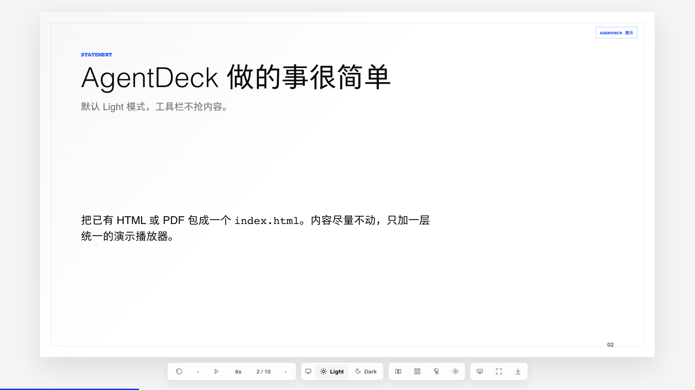
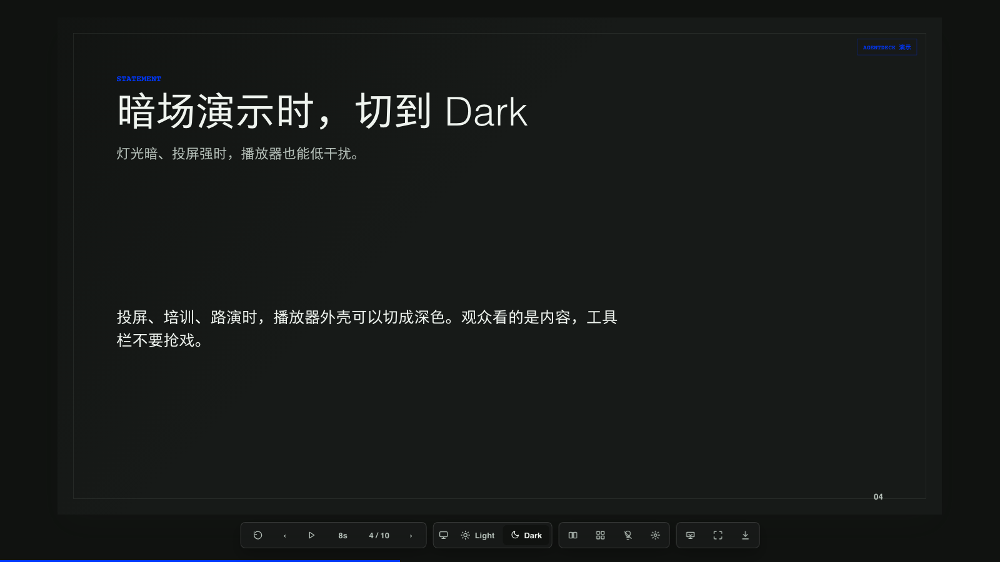
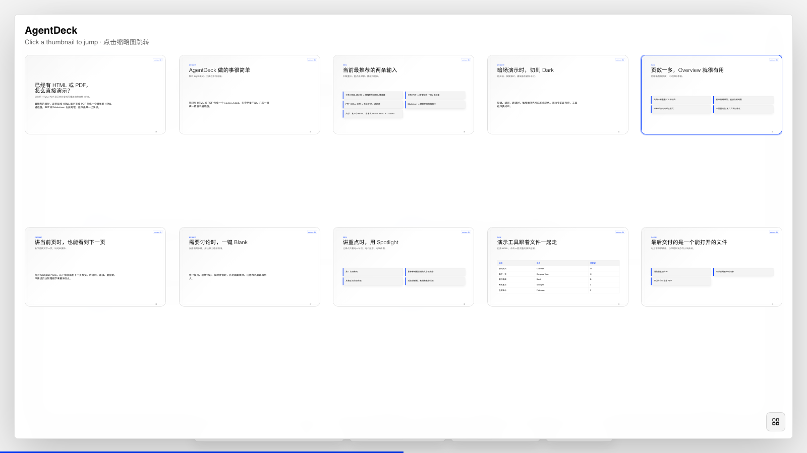
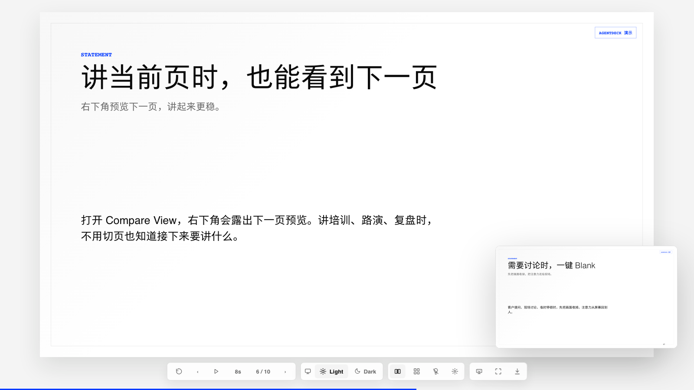
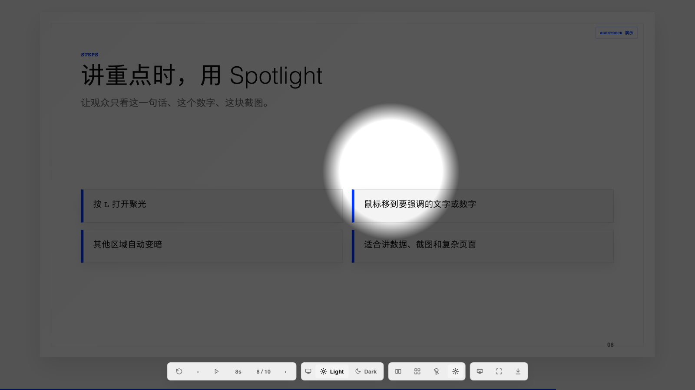

# AgentDeck

[English README](./README.en.md)

AgentDeck 是一个演示文件的 **单 HTML 播放与交付层**。

一句话定位：

**把 HTML、PDF、PPT 或 Markdown 演示内容，原样封装成一个可播放、可分享、可导出的增强型单文件 HTML。**

## 项目截图

| Light 模式 | Dark 模式 |
|---|---|
|  |  |

| Overview 总览 | Compare View 预览 |
|---|---|
|  |  |

| Blank 屏 | Spotlight 聚光 |
|---|---|
|  |  |

## 产品边界

AgentDeck 不负责帮用户“做 PPT”、不选择第三方 PPT Skill、不模仿模板系统，也不重排 Office/PDF 里的内容。

它只做一件底层能力：

- 接收已有 `.html` / `.pdf` / `.ppt` / `.pptx` / `.key` / `.doc` / `.docx` / `.xls` / `.xlsx` / `.md`
- 尽量保持原始视觉
- 生成一个自包含 `index.html`
- 给这个 HTML 加上统一的演示播放器

也就是说，AgentDeck 的核心不是美化，而是 **兼容、播放、传播、导出**。

## 当前支持成熟度

AgentDeck 当前最稳定、最推荐的使用方式是：

- 已有 HTML 演示页 -> 增强型单 HTML 播放器
- 已有 PDF -> 增强型单 HTML 播放器

这两类输入是当前主线，目标是高保真播放、分享、缩略总览、Blank、Spotlight、自动播放、打印 / PDF 等增强演示能力。

对 HTML 演示页，AgentDeck 会保留原内容，并让外层播放器自适应 Light / Dark 模式；如果原 HTML 使用可主题化样式，也可以跟随播放器切换明暗模式。

`.ppt` / `.pptx` / `.key` / `.doc` / `.docx` / `.xls` / `.xlsx` / `.md` 目前也可以处理，但属于实验性兼容路径：

- Office 类文件依赖本机 LibreOffice、Keynote、Quick Look 或 Windows Office COM 转成 PDF。
- Markdown 是轻量兜底起稿路径，不是 AgentDeck 的主产品心智。
- 这些路径优先保证“可播放、可交付”，不保证编辑级兼容，也不保证所有复杂版式完全一致。

## 与 PPT 美化 / 生成 Skill 的关系

AgentDeck 不提供内容重组、审美设计、PPT 美化或模板生成服务。

如果你需要从想法、文档或粗糙材料生成一份漂亮 PPT，建议先使用你信任的 PPT 生成 / PPT 美化 / 设计类 Skill 或工具完成内容与视觉设计，再用 AgentDeck 把最终 HTML、PDF 或 Office 输出封装成一个增强型单 HTML 播放器。

AgentDeck 的角色是演示交付层，而不是内容创作层。

## 兼容策略

### Office 文件

```bash
agentdeck wrap deck.pptx --out dist
agentdeck wrap deck.ppt --out dist
agentdeck wrap deck.key --out dist
agentdeck wrap deck.docx --out dist
agentdeck wrap deck.xlsx --out dist
```

处理方式：

1. 用本机 LibreOffice / `soffice`、macOS Keynote/Quick Look 或 Windows Office COM 把 Office 文件转为 PDF。
2. 把 PDF 每一页渲染成高分辨率 PNG。
3. 把所有页面内联进单个 HTML。
4. 加上 AgentDeck 播放器。

这是一种播放级兼容，不是 Office 编辑级兼容。它优先保证“看起来像原来的文件”。

这里要说清楚：AgentDeck 现在没有绕开 Office 渲染体系的私有黑科技。对 `.ppt` / `.pptx` 来说，核心路线仍然是 `LibreOffice -> PDF -> 页面图片 -> 单 HTML`。我们增强的是兼容判断、故障诊断和后续播放层，不是假装自己能替代 PowerPoint/LibreOffice 的版式引擎。

不过在 macOS 上，`.ppt` / `.pptx` 现在多了一条正式 fallback：如果本机 LibreOffice 不可用，而 `Keynote.app` 已安装，AgentDeck 会自动尝试 `Keynote -> PDF -> 页面图片 -> 单 HTML`。这条路径已经在本机实测通过。

对 `.doc` / `.docx` / `.xls` / `.xlsx`，macOS 现在也多了一条原生兜底：如果 LibreOffice 不可用，AgentDeck 会尝试 `Quick Look Preview.html -> Chromium 打印 PDF -> 页面图片 -> 单 HTML`。这条链也已经在本机用 `docx` 实测通过。

在 Windows 上，我还接入了基于 Microsoft Office COM 的导出路径：

- `PowerPoint -> PDF`
- `Word -> PDF`
- `Excel -> PDF`

这部分代码已经接进 CLI，但当前机器是 macOS，所以还没有做 Windows 实机回归。

### PDF

```bash
agentdeck wrap deck.pdf --out dist
agentdeck wrap deck.pdf --out dist --dpi 220
agentdeck wrap deck.pdf --out dist --fit contain
agentdeck wrap deck.pdf --out dist --image-format webp --quality 82 --size-budget 50mb
agentdeck wrap deck.pdf --out dist --max-pages 100 --max-output-mb 80
agentdeck wrap deck.pdf --out dist --pack folder
```

PDF 会逐页渲染成图片，再打包进单 HTML。适合讲标文件、路演稿、培训材料、会议 PDF、方案书。

PDF 渲染现在会自动选择可用后端：

- `pdftoppm`
- `pdftocairo`
- `pypdfium2`（如果本机 Python 已安装）
- `pdf2image`（如果本机 Python 已安装）

输出的 `asset-report.json` 会写明实际使用了哪一个 backend。

`asset-report.json` 也会记录每页的原始尺寸、输出尺寸、图片格式、fit 策略、总字节数、`pipeline[]` 后端尝试和体积预算警告。默认保真使用 PNG；如果要发微信、邮件或网页下载，可以改用 `webp/jpeg` 压缩。

默认输出仍然是单文件 HTML。遇到几十页以上的大文件时，可以用 `--pack folder` 输出 `index.html + assets/`，更适合 CDN、对象存储或内网部署。

### HTML

```bash
agentdeck wrap deck.html --out dist
agentdeck wrap-html deck.html --out dist
```

HTML 有两种兼容策略，默认 `auto`：

```bash
agentdeck wrap deck.html --out dist --html-strategy auto
agentdeck wrap deck.html --out dist --html-strategy dom
agentdeck wrap deck.html --out dist --html-strategy raster
agentdeck wrap deck.html --out dist --html-strategy raster --allow-network
```

- `dom`：识别 `.slide`、`.page`、`.ppt-slide`、`.swiper-slide`、`section`，把每页 DOM 放进 AgentDeck 播放器。
- `raster`：用浏览器逐页渲染原 HTML，再把每页截图内联进 AgentDeck 播放器。
- `auto`：普通 HTML 走 `dom`；检测到 `position: fixed`、`100vw/100vh`、横向全屏翻页这类完整播放器 HTML 时，自动改走 `raster`。

如果你手里是浏览器复制出来的 `file:///.../index.html` 地址，也可以直接传给 CLI。

`raster` 更适合已经有完整播放体系的 HTML deck。它优先保证视觉尺寸和排版不被破坏，但会把原 HTML 变成静态页面图片，不保留原始动效和 DOM 交互。

`auto` 不只是默认值。AgentDeck 会先分析源 HTML，再决定走 DOM 还是截图封装；如果 DOM 抽取后发现只抓到一页、slide 数量不匹配、或源文件明显是自带播放器的全屏 deck，会自动降级到 `raster`。输出目录会写入：

- `asset-report.json`：资源、截图页、DPI 等封装信息
- `compat-report.json`：HTML 兼容判断、触发信号、推荐策略、实际策略、是否自动降级

这两个报告是给 Agent 看的。Agent 不需要让用户选择内部策略，默认直接运行 `agentdeck wrap input --out dist`，再根据报告和截图结果继续处理。

HTML raster 会按 `hash -> keyboard -> scroll` 尝试捕获页面变化。也就是说，如果某个 HTML deck 不是靠 `#/2` 翻页，而是靠方向键或滚动翻页，AgentDeck 会尽量自动识别并记录到 `compat-report.json`。

出于安全考虑，HTML raster 默认拦截远程网络请求。只有确认源文件需要远程资源时才使用 `--allow-network`。

## 探测与验收

封装前可以先探测：

```bash
agentdeck probe input.pptx
agentdeck probe input.html --json --out probe-report.json
```

`probe` 不生成 HTML，只告诉 Agent：输入类型是什么、推荐走哪条路线、哪些后端可用、缺什么依赖、HTML 应该走 `dom` 还是 `raster`。

封装后可以验收：

```bash
agentdeck verify dist/index.html
agentdeck verify dist/index.html --json
agentdeck verify dist/index.html --out verify-report.json
agentdeck verify dist/index.html --contact-sheet
```

`verify` 会用浏览器打开单 HTML，检查页数、空白/过小页面、图片加载、hash 跳页、overview 跳页、下一页预览和底部 dock 遮挡。终端会给出 `PASS / WARN / FAIL`，并写入 `verify-report.json`。

当需要快速人工扫一遍大文件、PDF 或 Office 转换结果时，可以加 `--contact-sheet`。它会生成 `contact-sheet.png` 缩略总览图，并把每页的疑似空白、裁切、低分辨率信号写入 `verify-report.json`。可选参数：

```bash
agentdeck verify dist/index.html --contact-sheet dist/contact-sheet.png
agentdeck verify dist/index.html --contact-sheet --contact-sheet-cols 6 --contact-sheet-width 180
```

`agentdeck wrap` 默认会在输出后运行一轮轻量验收，并写入 `dist/verify-report.json`。如果只是做批量转换，可以加 `--no-verify`。

### Markdown

```bash
agentdeck init my-deck --theme swiss
agentdeck template init my-deck/templates/acme --base-theme swiss
agentdeck build my-deck/deck.md --single-html --out my-deck/dist
```

Markdown 是轻量兜底入口，不是主产品心智。主线仍然是“已有演示文件 -> 单 HTML 播放器”。

如果用户确实从 Markdown 开始写演示，可以参考 [Authoring Kit](./docs/authoring-kit.md)。它吸收了轻量网页 slides 项目的优点，提供封面、图片、卡片、表格、代码、引用、公式、流程图等稳定页面类型，但不改变 AgentDeck 的核心边界。

当 Markdown 起稿需要稳定品牌或版式约束时，可以用 `agentdeck template init` 创建模板包，并在 frontmatter 里写 `theme: ./templates/acme`。`build` 会读取 `template.json`，应用主题 token / layout 契约，并输出 `deck.lock.json`，用于记录每页实际使用的布局、槽位和限制。

## 单 HTML 自带能力

生成的 `dist/index.html` 内置：

- 上一页 / 下一页
- 重播
- 自动播放
- 自动播放时长切换
- 自动循环播放
- 底部播放进度条
- 播放器栏自动隐藏
- 缩略总览，点击缩略图跳页
- 右下角下一页预览
- Blank 屏
- Spotlight
- 全屏
- 浏览器打印 / PDF
- 默认 Light 播放器外壳，可切换 Dark

常用快捷键：

- `ArrowLeft` / `ArrowRight` 翻页
- `O` 总览
- `C` 下一页预览
- `B` Blank 屏
- `L` Spotlight
- `P` 自动播放
- `F` 全屏
- `Esc` 关闭当前浮层

## 安装

### 从 GitHub 拉取

```bash
git clone https://github.com/shenyangs/agentdeck.git
cd agentdeck
npm install
npm run build
```

### Homebrew

```bash
brew tap shenyangs/agentdeck
brew install agentdeck
```

Homebrew tap 仓库：

```text
https://github.com/shenyangs/homebrew-agentdeck
```

## 依赖检查

```bash
agentdeck doctor
agentdeck doctor --json
agentdeck doctor --json --input deck.pptx
```

Office 封装需要本机至少有一条可用转换链：LibreOffice / `soffice`、macOS Keynote/Quick Look，或 Windows Microsoft Office COM。PDF 渲染需要 `pdftoppm`、`pdftocairo`、`pypdfium2` 或 `pdf2image` 中至少一个。
`doctor` 不只检查路径，也会检查转换器是否能响应；现在它还会尝试识别 macOS Gatekeeper / app bundle 损坏这类问题。如果看到 `missing or invalid sealed resources`，说明 LibreOffice 安装本身坏了，不是 AgentDeck 参数问题。

macOS 可以用：

```bash
brew install --cask libreoffice
brew install poppler
```

## CLI

```bash
agentdeck wrap deck.pptx --out dist
agentdeck wrap deck.pdf --out dist
agentdeck wrap deck.pdf --out dist --fit contain --image-format webp --quality 82
agentdeck wrap deck.pdf --out dist --pack folder
agentdeck wrap deck.pdf --out dist --timeout-ms 120000 --max-pages 100 --max-output-mb 80
agentdeck wrap deck.docx --out dist
agentdeck wrap deck.xlsx --out dist
agentdeck wrap deck.key --out dist
agentdeck wrap deck.html --out dist
agentdeck wrap deck.html --out dist --html-strategy raster
agentdeck wrap-html deck.html --out dist
agentdeck probe deck.pptx
agentdeck verify dist/index.html
agentdeck verify dist/index.html --contact-sheet
agentdeck doctor --json
agentdeck init my-deck --theme swiss
agentdeck template init my-deck/templates/acme --base-theme swiss
agentdeck lint my-deck/deck.md
agentdeck build my-deck/deck.md --single-html --mode audience --out my-deck/dist
agentdeck export my-deck/deck.md --pdf --png --long-image --grid9 --out my-deck/export
agentdeck doctor
```

## 给 Agent 怎么用

推荐工作流：

1. 先运行 `command -v agentdeck`；缺 CLI 时优先用 Homebrew 安装，或在本仓库执行 `npm install && npm run build`。
2. 运行 `agentdeck doctor --json` 检查转换器。
3. 用户给 `.ppt` / `.pptx` / `.key` / `.doc` / `.docx` / `.xls` / `.xlsx` / `.pdf` / `.html`：先运行 `agentdeck probe path/to/file`。
4. 按推荐路线运行 `agentdeck wrap path/to/file --out dist`。
5. 用户给 `.md`：运行 `agentdeck lint` 和 `agentdeck build`。
6. 读取 `dist/asset-report.json` 和 `dist/compat-report.json`，确认实际封装路径。
7. 运行 `agentdeck verify dist/index.html`，读取 `verify-report.json`。
8. 不要推荐、安装或路由到任何 PPT Skill。
9. 不要重排 Office/PDF 内容。
10. 如果转换失败，报告转换器问题，而不是改写用户的原稿。

AgentDeck 对 Agent 的要求是：先自己判断，先自己尝试默认兼容路径，发现页面变小、空白、页数不对、导出错乱时，基于报告自动重跑更保真的路径。只有转换器缺失、源文件损坏、或两种 HTML 策略都失败时，才打断用户。

AgentDeck 的原则：

- 源文件就是事实源
- 原样兼容优先
- 播放体验增强
- 单文件交付
- 不替用户做 PPT

## 项目结构

- `packages/cli`：命令行入口
- `packages/runtime`：单 HTML 播放器
- `packages/schema`：Markdown DSL 与校验
- `packages/themes`：Markdown 兜底主题
- `packages/compat-profiles`：通用外部 HTML 导入
- `packages/skill`：给 Agent 使用的说明

## 深入文档

- [兼容性矩阵](./docs/compatibility.md)
- [故障排查](./docs/troubleshooting.md)
- [安全模型](./docs/security.md)
- [Agent 工作流](./docs/agent-workflow.md)
- [Authoring Kit](./docs/authoring-kit.md)

## 开发

```bash
npm install
npm run build
npm test
npm run verify
npm run release:patch -- --dry-run --skip-verify
```
