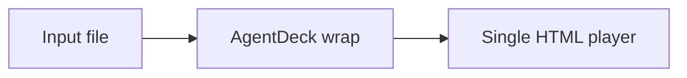

# AgentDeck Authoring Kit

AgentDeck 的主线是封装已有演示文件，不是做 PPT 生成器。Authoring Kit 只服务一种情况：用户没有现成 PPT/PDF/HTML，或者明确希望从 Markdown 写一个轻量 deck。

这个能力参考了 Prism-Shadow/minimal-web-slides 的组织方式和页面类型思路。该项目使用 Apache-2.0 许可证；AgentDeck 不复制其代码或视觉实现，只吸收适合 Agent 改稿的结构经验：

- 固定 16:9 画布与整体缩放
- 常见页面类型稳定可复用
- 内容、素材、播放器边界清楚，方便 Agent 改稿

## 推荐结构

简单项目：

```text
deck/
  deck.md
  assets/
    images/
  dist/
```

较复杂项目：

```text
deck/
  content/
    deck.md
    notes.md
  assets/
    images/
  dist/
```

Agent 应该优先编辑 `deck.md` 和 `assets/`，不要修改 AgentDeck runtime。

## Template Pack

当 Markdown 起稿需要稳定的品牌或版式约束时，可以把主题升级为模板包。模板包是一个目录，至少包含 `template.json`：

```text
templates/acme/
  template.json
  assets/
  layouts/
  previews/
```

先生成骨架：

```bash
agentdeck template init templates/acme --base-theme swiss
```

然后在 `deck.md` frontmatter 中引用这个目录：

```yaml
---
title: Q3 Strategy Review
theme: ./templates/acme
---
```

`agentdeck build` 会读取 `templates/acme/template.json`，把模板里的主题 token 和布局契约应用到渲染，并输出：

```text
dist/
  index.html
  asset-report.json
  deck.lock.json
```

`deck.lock.json` 是生成阶段的锁定合约，记录每页实际使用的 layout、slot 和 content limits。它对应从 PPT Master 借鉴来的 `spec_lock` 思路，但保持为 AgentDeck 的 JSON 报告风格，便于后续验证和自动重跑。

模板包 MVP 先支持手写或半自动维护的 `template.json`。以后如果要接入 `.pptx` 模板复制，可以让 `agentdeck template import reference.pptx --out templates/acme` 生成同一种目录结构，而不改变 Markdown/build/verify 主链路。

## 页面类型

| 类型 | 用途 | Markdown 建议 |
| --- | --- | --- |
| cover | 封面 | `layout: cover` |
| image-hero | 大图页 | `layout: image-hero` + `image:` |
| cards | 信息卡片 | 列表或短段落 |
| table | 数据表格 | Markdown table |
| code | 代码页 | fenced code |
| quote | 引用 / 金句 | Markdown blockquote |
| formula | 数学公式 / 概念公式 | `::formula ...` |
| diagram | 流程图 / 系统图 | mermaid fenced code |
| timeline | 时间线 | 列表或日期项 |
| steps | 步骤 / 课程流程 | 有序列表 |

## Agent 工作流

1. 确认用户是从 Markdown 起步，而不是要保持既有 PPT/PDF/HTML。
2. 编辑 `deck.md` frontmatter 和 slide 段落。
3. 使用已有布局，不直接写 runtime 代码。
4. 本地素材放入 `assets/`。
5. 运行：

```bash
agentdeck lint deck.md
agentdeck build deck.md --single-html --out dist
agentdeck verify dist/index.html
```

## 示例

````md
---
title: Product Brief
theme: swiss
outputs: [html]
---

# Product Brief
layout: cover

One file, one player, one shareable deck.

# Architecture
layout: diagram


````

## 边界

不要把 Authoring Kit 用作第三方 PPT Skill 路由，也不要用它重排用户已有的 Office/PDF/HTML 文件。已有文件走 `agentdeck wrap`，Markdown 起步才走 Authoring Kit。
