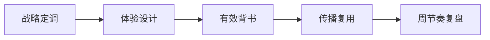

# AI 内容生产协作平台 · 讲标版
layout: cover
note: 把材料改写成评分点、响应矩阵、方案架构和实施计划。

一份通用业务 brief，用来测试不同演示场景如何重排

# 评分点映射
layout: table
note: 评委先看是否响应关键要求。

| 评分点 | 响应策略 | 证据材料 |
| --- | --- | --- |
| 战略理解 | AI 内容生产协作平台 | 方案总览 |
| 传播质量 | 用单 HTML 把播放、导出和传播统一到一个文件。 | KPI 矩阵 |
| 执行保障 | 现在的问题 | 项目计划 |

# 响应矩阵
layout: comparison
note: 把客户要求和我们的交付对齐。

| 客户要求 | 我们的响应 |
| --- | --- |
| 避免重复投入 | 发布会定调，展会体验 |
| 提升传播可信度 | 权威媒体、KOL、真实评测组合 |
| 形成视觉记忆点 | 场地、识别、社媒物料一体设计 |

# 方案架构
layout: diagram
note: 讲标时用结构图替代散点描述。

# 实施计划
layout: timeline
note: 按周说明项目可控。

- 第 1 周：叙事和需求确认
- 第 2 周：视觉与体验打样
- 第 3 周：媒体与 KOL 材料
- 第 4 周：讲稿、FAQ、风险复盘

# 风险假设
layout: checklist
note: 主动暴露风险，提升可信度。

- 发布会和展会信息重复
- 稿件数量掩盖传播质量
- 品牌命名造成认知割裂
- 视觉资产无法跨渠道复用

# 案例证明
layout: evidence-grid
note: 等待真实案例和截图补位。

- 权威报道样例
- KOL 体验样例
- 展区动线样例
- 社媒长图样例

# 收束
layout: closing
note: 结束页只留下最重要的下一步。

- 逐项响应
- 证据闭环
- 风险前置
