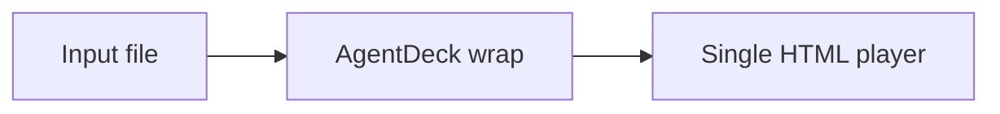

# AgentDeck Authoring Kit

AgentDeck is primarily a compatibility wrapper. Use the authoring kit only when the user starts from Markdown or explicitly asks for a lightweight source deck.

Do not use this path to redesign Office, PDF, or existing HTML input. For those files, use `agentdeck wrap`.

## Purpose

The authoring kit borrows structural lessons from Prism-Shadow/minimal-web-slides, an Apache-2.0 project. Do not copy its code or visual implementation; use the same kind of agent-friendly separation:

- a fixed 16:9 design canvas
- reusable page types
- local assets
- a clear split between deck metadata, slide content, and presentation runtime
- easy Agent edits: change metadata, add a slide, replace an image, or switch a layout

In AgentDeck, this should remain Markdown-first. The source of truth is still `deck.md`, not hand-edited runtime code.

## Template Packs

Use a template pack when Markdown authoring needs stable brand or layout constraints. Create a starter pack with:

```bash
agentdeck template init templates/acme --base-theme swiss
```

Then reference the directory in frontmatter:

```yaml
---
title: Product Brief
theme: ./templates/acme
---
```

The pack lives at `templates/acme/template.json` and can define theme tokens, layouts, assets, and quality rules. `agentdeck build` writes `dist/deck.lock.json`, which records the concrete layout, slots, and content limits used per slide. Treat that lock file as the generation contract for follow-up review.

## Page Types

Use these as stable Markdown page patterns:

- `cover`: title, subtitle, author, date
- `image-hero`: one dominant image with caption
- `cards`: repeated cards or product/module cards
- `table`: structured comparison or evidence
- `code`: code block with language label
- `quote`: quotation or key sentence
- `formula`: math expression or conceptual equation
- `diagram`: Mermaid or simple flow/system diagram
- `timeline`: dated milestones
- `steps`: process or teaching sequence

## Suggested Folder Shape

For Markdown-native decks:

```text
deck/
  deck.md
  assets/
    images/
  dist/
```

For larger authored examples or fixtures:

```text
deck/
  content/
    deck.md
    notes.md
  assets/
    images/
  dist/
```

This mirrors the clarity of componentized slide projects without making users edit the AgentDeck runtime.

## Agent Rules

- Prefer existing `deck.md` and `assets/`.
- Edit metadata in frontmatter.
- Add a slide by adding a new `# Heading` section.
- Use a known `layout:` before inventing custom HTML.
- Keep images local when possible.
- Run `agentdeck lint deck.md` before build.
- Run `agentdeck build deck.md --single-html --out dist`.
- If `theme` points at a template directory, inspect `dist/deck.lock.json` after build.
- Run `agentdeck verify dist/index.html` after build.

## Example

````md
---
title: Product Brief
theme: swiss
outputs: [html]
---

# Product Brief
layout: cover

One file, one player, one shareable deck.

# Architecture
layout: diagram


````

If the user wants visual design beyond these page types, ask whether they want a separate creative deck workflow. Do not silently turn AgentDeck into a PPT generation skill.
